# NativeLab

A native GitLab client for iOS. Built with React Native and Expo.

Review merge requests, triage issues and watch pipelines from a client that feels like it belongs on the phone. Sign in with OAuth to gitlab.com or your own instance. Tokens stay in the iOS Keychain and never touch a third-party server.

## Screenshots

Light and dark follow the system setting or a manual choice in Settings.

### Light

  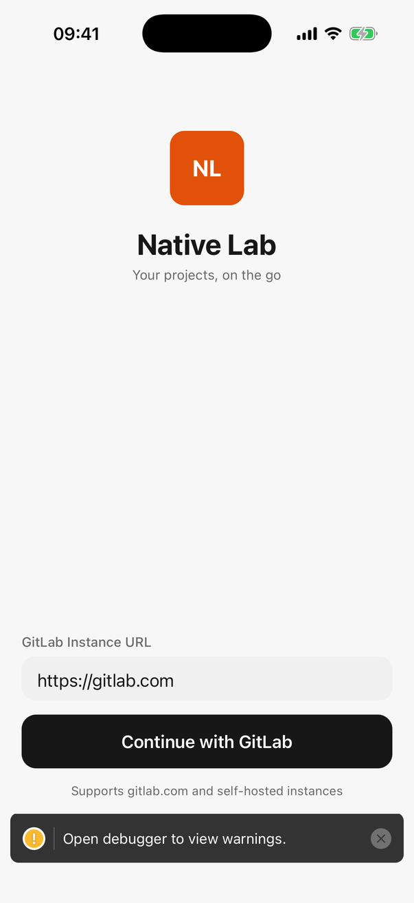
  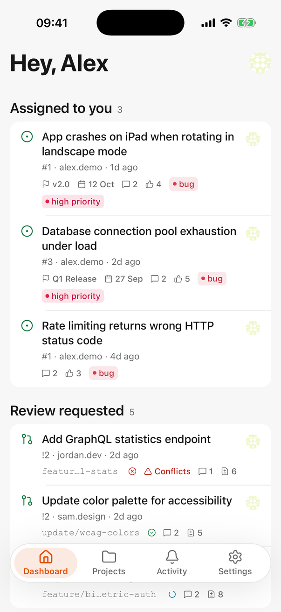
  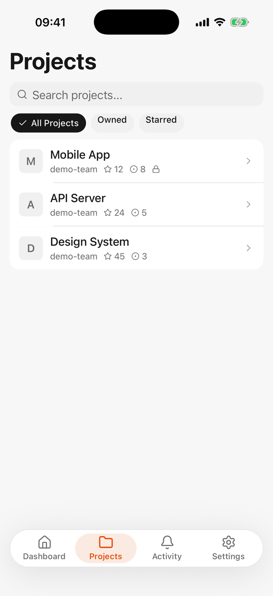
  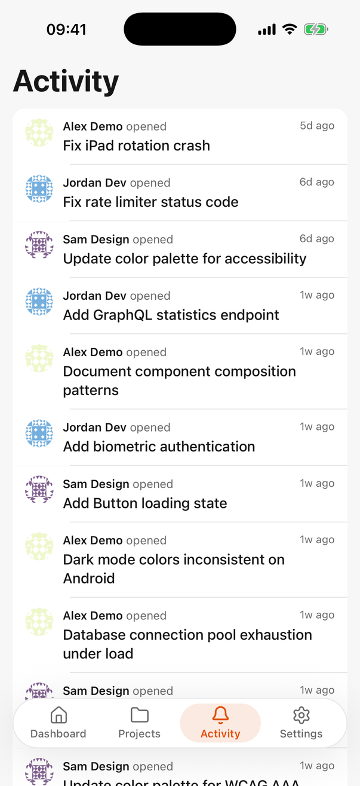

  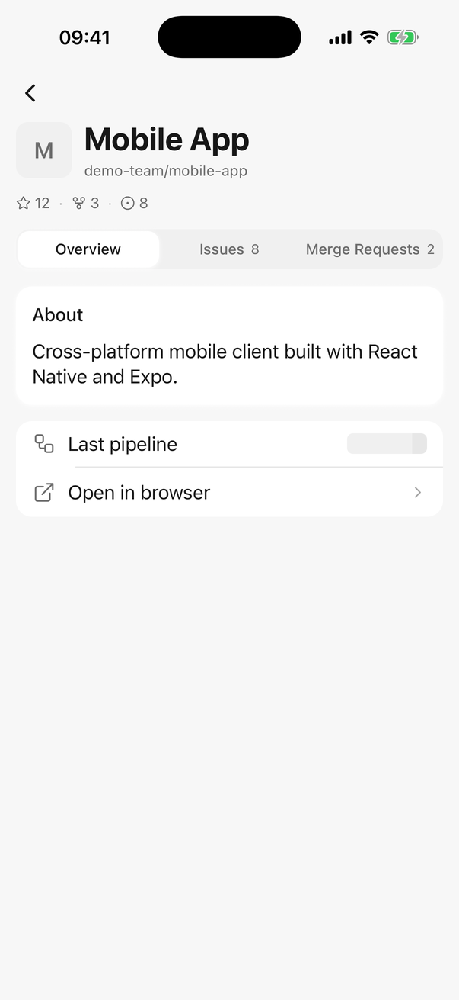
  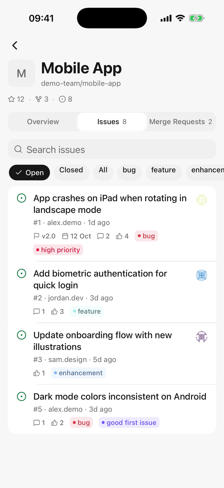
  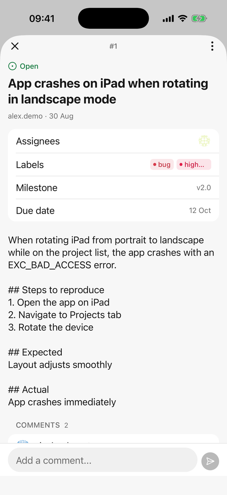
  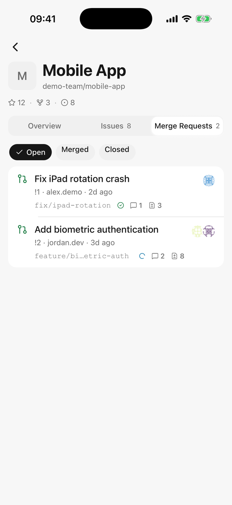

  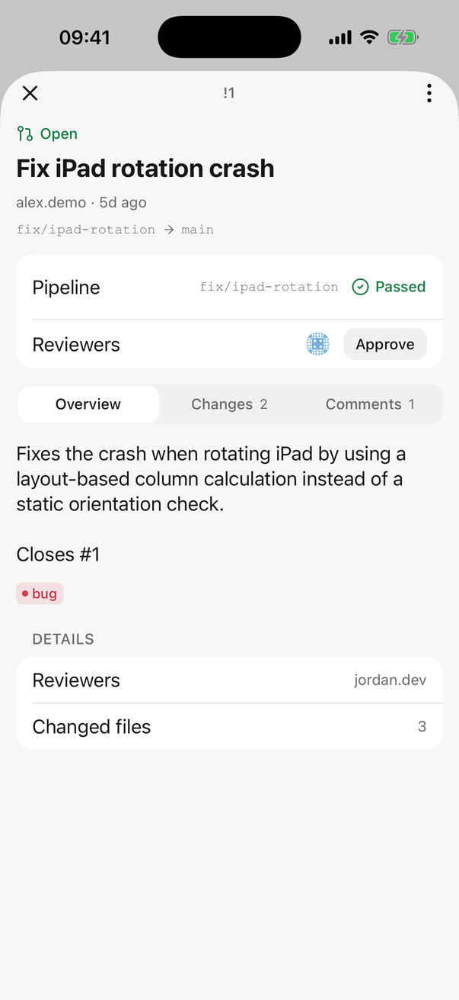
  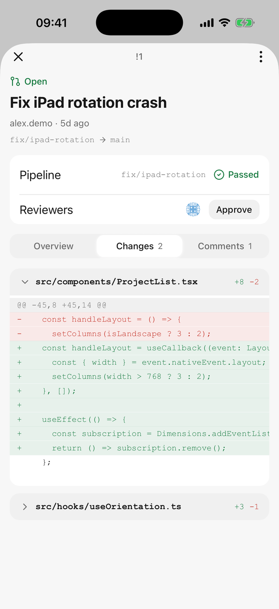
  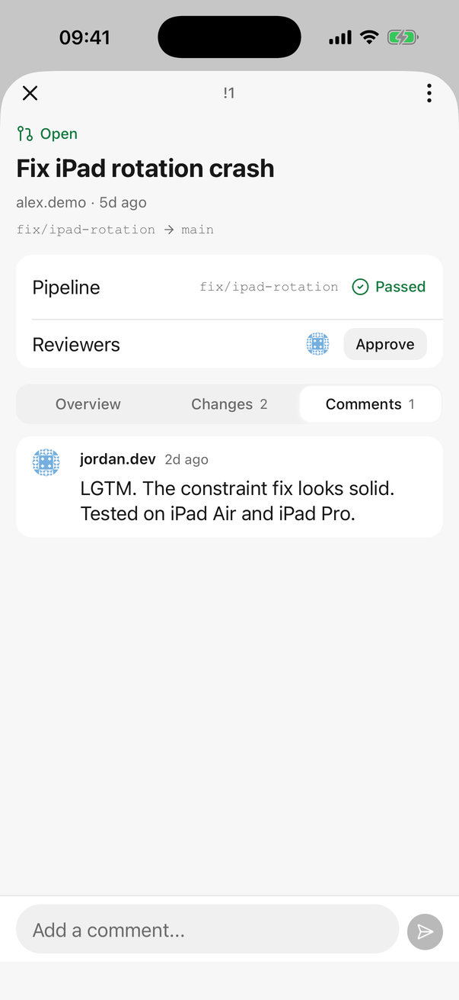
  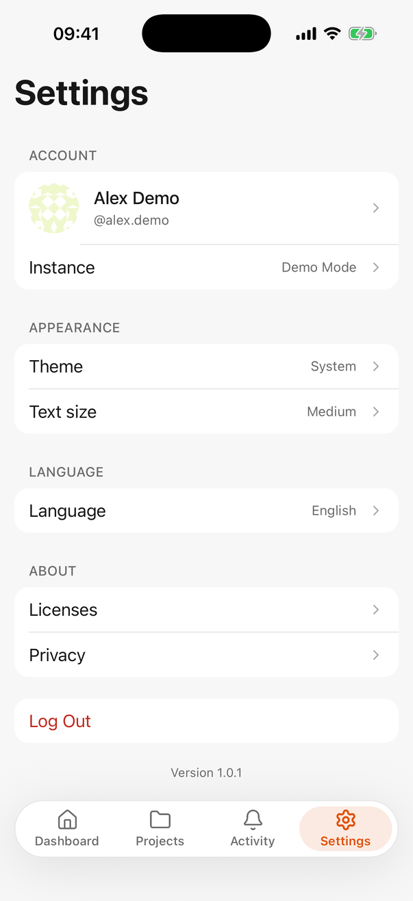

### Dark

  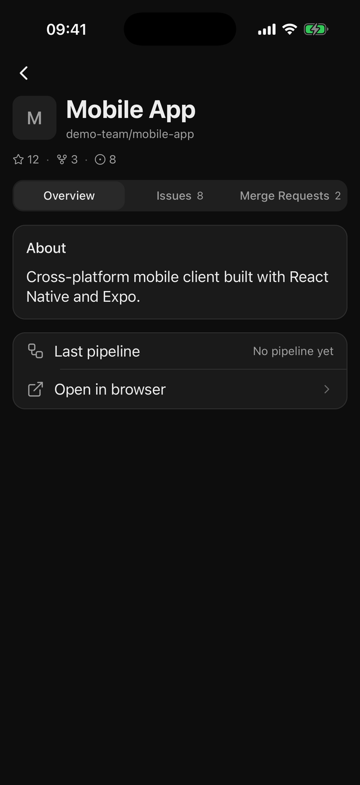
  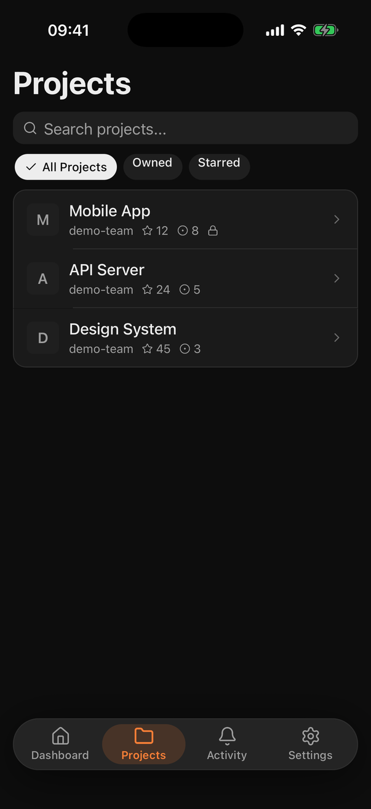
  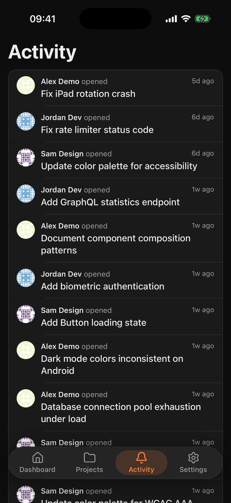
  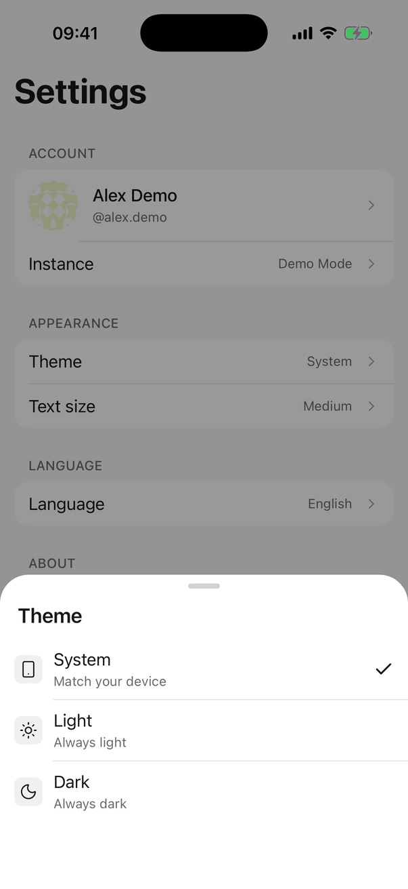

  
  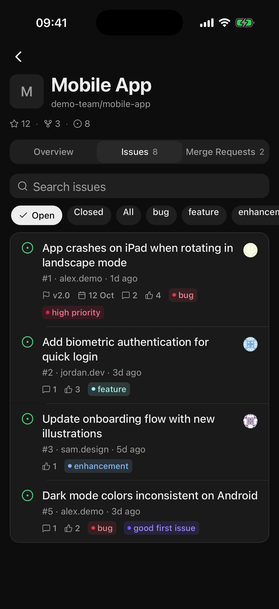
  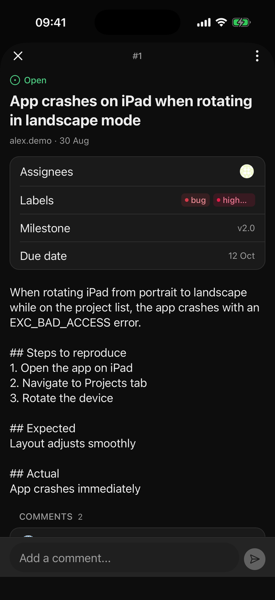
  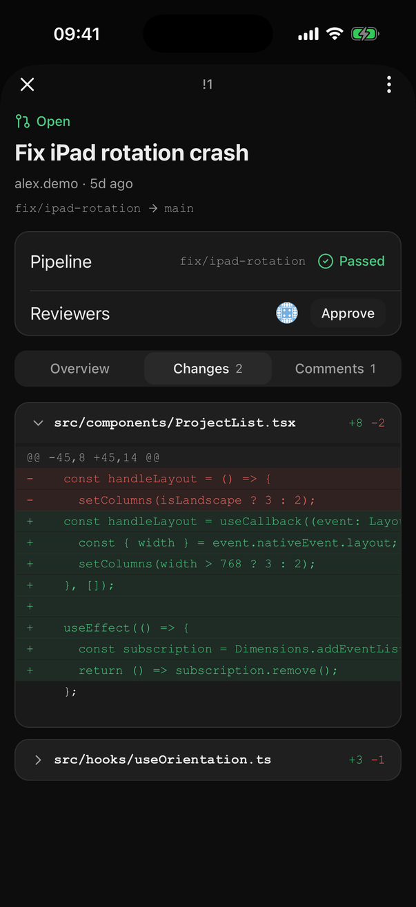

## Features

- **Dashboard**: issues assigned to you, merge requests waiting on your review and recent activity, one screen.
- **Projects**: every project you can reach, with search and owned or starred filters.
- **Issues**: filter by state and label, read the full description, tasks and comments, reply inline.
- **Merge requests**: description, branch pair, pipeline status, reviewers, approvals, a per-file diff viewer and the comment thread.
- **Pipelines**: latest pipeline state on projects and merge requests, with the CI job that failed.
- **Activity**: a feed of what happened across your projects.
- **Themes**: light and dark, both designed on the same neutral palette, with a system option.
- **Text size**: small, medium or large, applied across the whole app.
- **Languages**: English, German, French, Spanish, Portuguese and Turkish.
- **Self-hosted**: works with gitlab.com and any self-hosted GitLab instance over OAuth.
- **Demo mode**: try the app with sample data, no account needed.
- **Privacy**: direct OAuth to your GitLab, no proxy servers, no analytics in the app.

## Requirements

iOS 16 or later. Android is on the roadmap.

## License

All rights reserved.
