# NativeLab

A native GitLab mobile client for iOS and Android, built with React Native and Expo.

Browse your projects, issues, and merge requests on the go — with full offline theming, multi-language support, and a clean native experience.

## Screenshots

  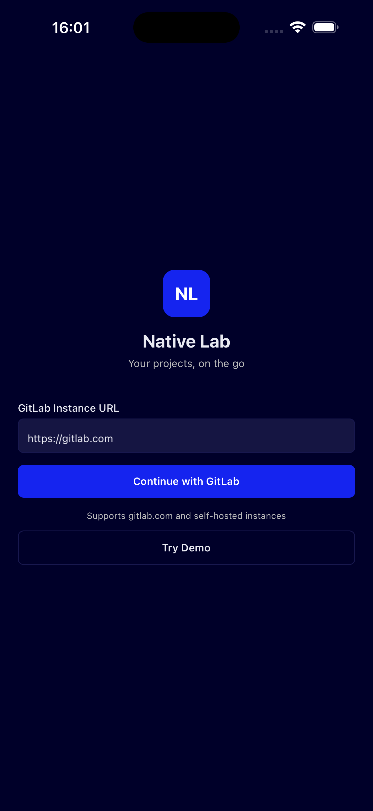
  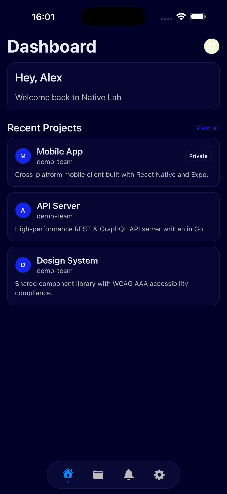
  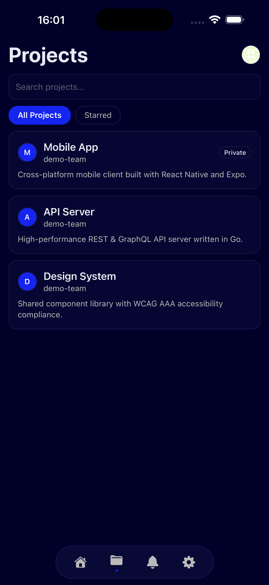
  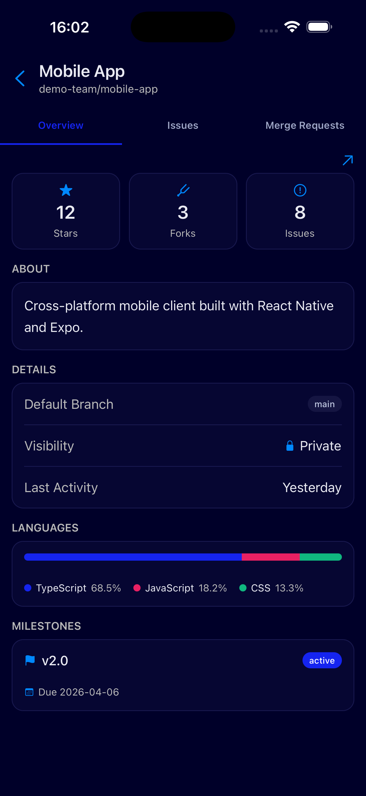

  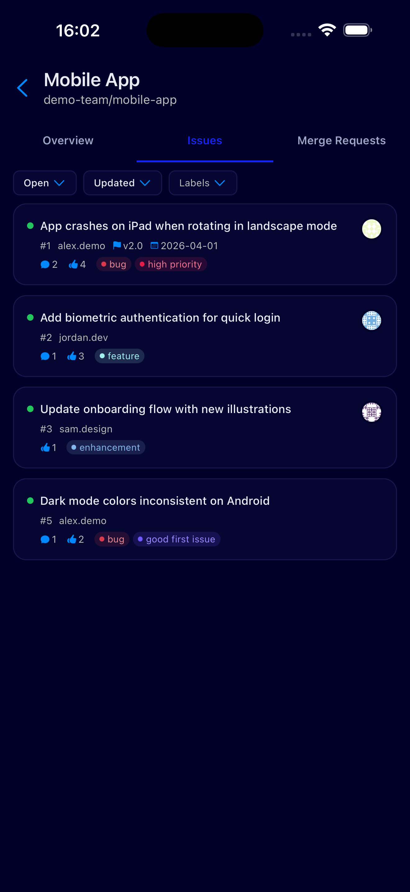
  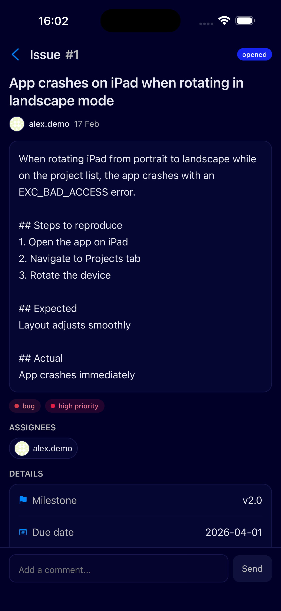
  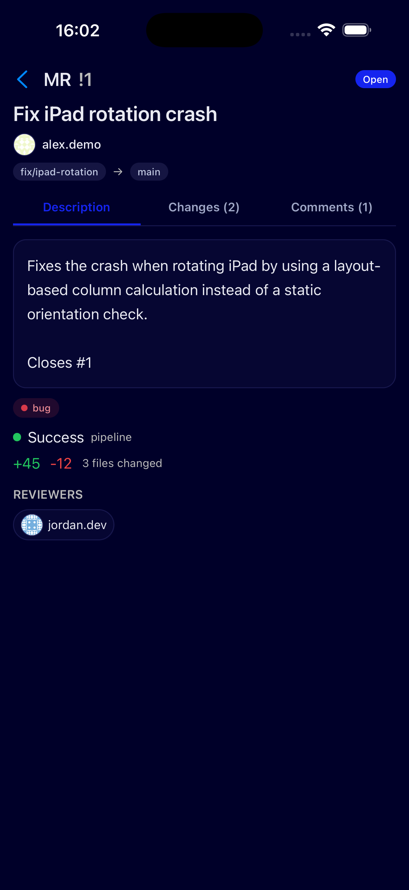
  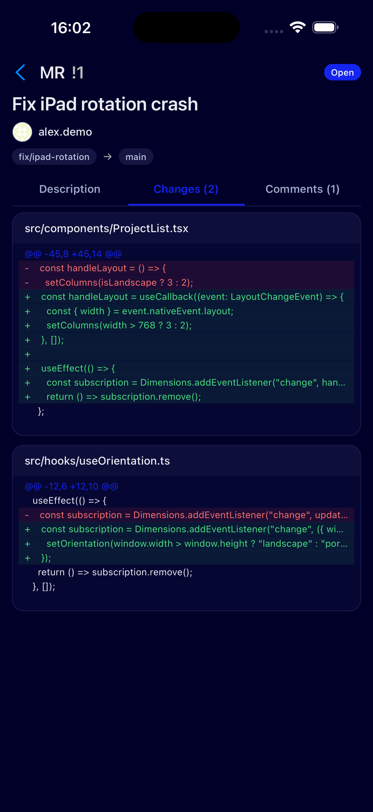

  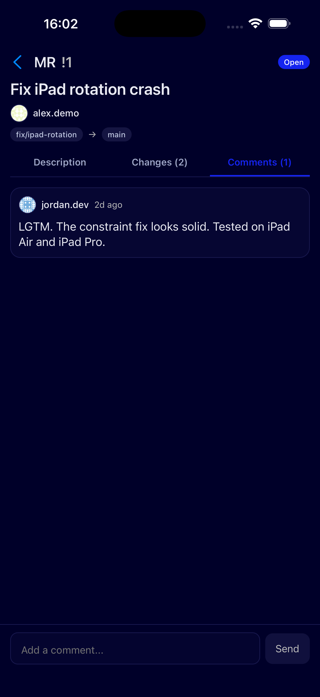
  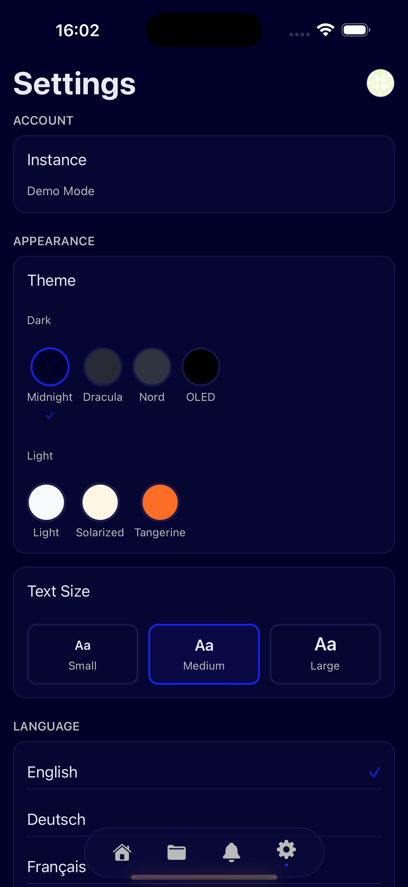
  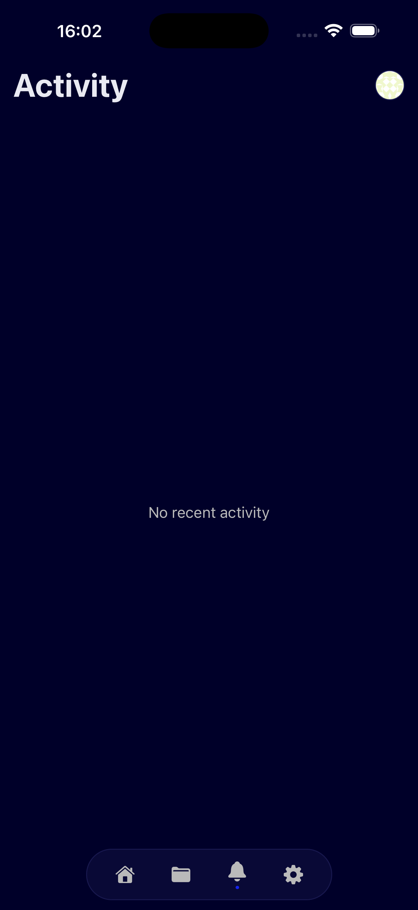

## Features

- **Projects** — Browse all your GitLab projects with search and starred filters
- **Issues** — View, filter by state/labels, and read full issue details with comments
- **Merge Requests** — Review MRs with description, diff viewer, pipeline status, and comments
- **Themes** — 7 built-in themes (4 dark, 3 light) including OLED black and Dracula
- **Multi-language** — English, German, French, Spanish, Portuguese, Turkish
- **Demo Mode** — Try the app without a GitLab account
- **Self-hosted** — Works with gitlab.com and any self-hosted GitLab instance

## License

All rights reserved.
